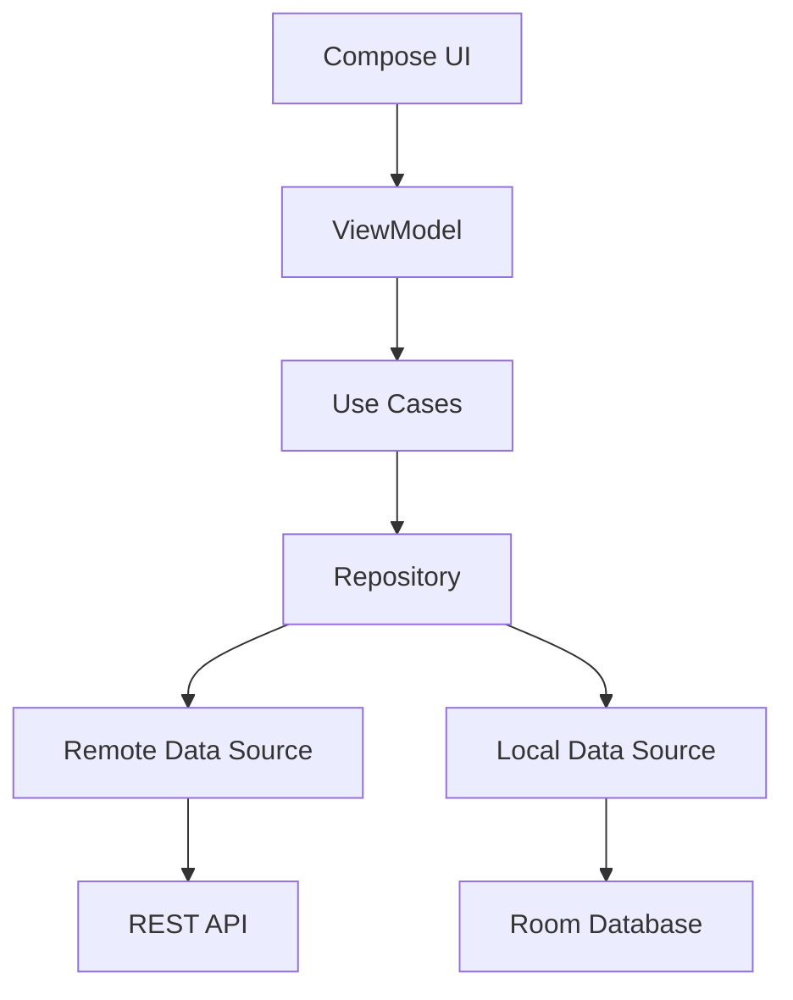
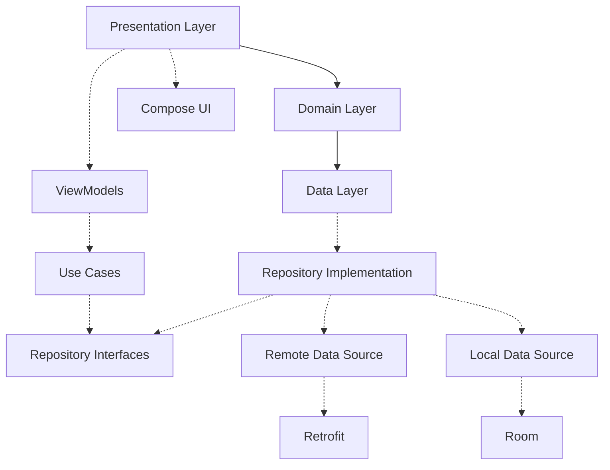
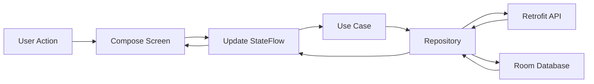

<div align="center">

# 📰 News App

**A highly scalable, modern Android application showcasing production-ready architecture and elegant UI.**

[](#)
[](#)
[](#)
[](#)
[](#)
[](#)
[](#)
[](#)
[](#)
[](#)
[](#)
[](#)

</div>

---

## ✨ 3. Features

### 📰 News
* **Category Browsing**: Seamlessly filter articles by Business, Entertainment, General, Health, Science, Sports, and Technology.
* **Source Filtering**: View breaking news exclusively from your trusted publishers and sources.
* **Article Deep Dive**: Access full article details and read comprehensive reports.

### 🎨 User Experience
* **Modern UI**: Fully built with Jetpack Compose featuring elegant Material 3 design paradigms.
* **Responsive Layouts**: Fluid and adaptive UI components that look great across varying screen densities.
* **Dark Mode**: Beautiful, system-aware dynamic theming for comfortable nighttime reading.
* **Pull to Refresh**: Intuitive swipe gestures to instantly fetch the latest headlines.

### 🏗 Architecture
* **Clean Architecture**: Highly modularized layers ensuring strict separation of concerns.
* **UDF (Unidirectional Data Flow)**: Predictable state management using MVVM and StateFlow.

### ⚡ Performance
* **Efficient Image Loading**: Optimized asynchronous image fetching and caching using Coil.
* **Coroutines**: Lightweight, non-blocking asynchronous operations ensuring a 60fps UI experience.

### 📡 Offline & Networking
* **Offline Caching**: Built-in Room database integration allows users to read cached articles without an internet connection.
* **Error Handling**: Graceful fallback UI for network failures or empty states.

---

## 🛠 4. Tech Stack

| Category | Technology |
| :--- | :--- |
| **Language** | Kotlin |
| **UI Toolkit** | Jetpack Compose |
| **Design System** | Material 3 (M3) |
| **Architecture** | MVVM, Clean Architecture, Repository Pattern |
| **Networking** | Retrofit, OkHttp |
| **Database** | Room |
| **Dependency Injection** | Dagger Hilt |
| **Asynchrony** | Coroutines, Flow / StateFlow |
| **Navigation** | Navigation Compose |
| **Image Loading** | Coil |
| **Serialization** | Gson |

---

## 🏛 5. Clean Architecture

> [!NOTE]
> This application implements **Clean Architecture** to guarantee that business rules are completely isolated from UI and framework implementations.

* **Clean Architecture**: Ensures the project is scalable, testable, and independent of external frameworks.
* **MVVM**: Connects the View (Compose) to the ViewModel, which holds UI states and handles user intents.
* **Repository Pattern**: Abstracts the origin of data (Network vs Local). The Domain layer only knows *what* data it needs, not *where* it comes from.
* **Separation of Concerns**: Each class has a single, well-defined purpose.
* **Single Source of Truth**: The Local Database (Room) or Repository acts as the ultimate source of truth, preventing race conditions or inconsistent UI states.



### Layer Responsibilities
1. **Presentation Layer (UI/ViewModel)**: Observes StateFlow from the ViewModel and renders Jetpack Compose UI. Captures user intents and forwards them to the ViewModel.
2. **Domain Layer (Use Cases/Interfaces)**: Pure Kotlin modules holding business logic and abstract repository interfaces. Completely decoupled from Android dependencies.
3. **Data Layer (Repositories/Data Sources)**: Implements repository interfaces. Decides whether to fetch data from the `Remote Data Source` (Retrofit) or load cached data from the `Local Data Source` (Room).

---

## 📂 6. Project Structure

```text
app/src/main/java/com/route/news/
│
├── data/
│   ├── api/                 # Retrofit API services and DTO models
│   ├── database/            # Room Database, DAOs, and Entity models
│   ├── di/                  # Hilt modules (Network, Database, Repositories)
│   ├── mapper/              # Mappers to convert Data models to Domain models
│   └── repositories/        # Implementations of Domain repository interfaces & Data Sources
│
├── domain/
│   ├── model/               # Pure Kotlin data classes representing business entities
│   ├── repository/          # Abstract interfaces for data operations
│   └── usecase/             # Reusable, single-action business logic classes
│
├── ui/
│   ├── composables/         # Reusable Jetpack Compose UI widgets
│   ├── model/               # UI-specific state representations
│   ├── screens/             # Top-level Compose screens (Home, Splash, etc.)
│   ├── theme/               # Material 3 Color, Typography, and Shape definitions
│   └── utils/               # UI formatting and helper extensions
│
└── utils/                   # App-wide utilities, constants, and helper functions
```

### Package Details
* **`data`**: Handles all infrastructure details. It knows about Retrofit, Room, and JSON mapping.
* **`domain`**: The heart of the application. It dictates what data the app needs to function but doesn't care how it is fetched.
* **`ui`**: The presentation logic. It knows only about Jetpack Compose and ViewModels.
* **`utils`**: Shared resources utilized across multiple layers.

---

## 🧩 7. Project Module Relationships



### Why this architecture?
By strictly enforcing these boundaries, the architecture improves **maintainability** (changes in the API only affect the Data layer) and **scalability** (new features can be added by creating new Use Cases and ViewModels without breaking existing flows). It also makes **testing** significantly easier, as the Domain and ViewModel layers can be tested using mock Repositories.

---

## 🔄 8. Data Flow

> [!TIP]
> The app utilizes a **Unidirectional Data Flow (UDF)** to ensure UI state changes are predictable and easily debuggable.



### The Request Lifecycle
1. The **User** interacts with the **Compose UI** (e.g., pulling to refresh).
2. The UI sends an Intent/Event to the **ViewModel**.
3. The ViewModel invokes a specific **Use Case**.
4. The Use Case requests data from the **Repository**.
5. The Repository checks the **Local Database (Room)** or fetches fresh data from the **Network (API)**.
6. The retrieved data is mapped to Domain models and returned to the **ViewModel**.
7. The ViewModel updates its reactive `StateFlow`.
8. The **Compose UI** observes this `StateFlow` and automatically recomposes to display the new data.

---

## 💉 9. Dependency Injection

**Dagger Hilt** is utilized heavily to manage dependencies efficiently and reduce boilerplate code.

* **Singletons**: Hilt manages single instances of expensive objects like the `RoomDatabase` and `Retrofit` client.
* **ViewModel Injection**: Hilt automatically injects the required Use Cases into the ViewModels using `@HiltViewModel`.
* **Modules**: Located in the `data/di/` package, these modules provide configurations for Network capabilities (`OkHttpClient`, `GsonConverterFactory`), Local Storage (`NewsDao`), and bind Repository interfaces to their implementations.

---

## 🔮 13. Future Improvements

As an ongoing open-source endeavor, here are highly-valuable features planned for future iterations:

* **Pagination (Paging 3)**: Implement Jetpack Paging to load massive lists of articles with minimal memory footprint.
* **Bookmark Synchronization**: Allow users to save articles to a "Favorites" tab, persisting them via Room.
* **Push Notifications**: Integrate Firebase Cloud Messaging (FCM) for breaking news alerts.
* **Unit Testing**: Achieve high code coverage using JUnit 5, MockK, and Coroutine Test Dispatchers for the Domain and ViewModel layers.
* **UI Testing**: Implement robust end-to-end testing using Jetpack Compose Testing libraries.
* **Multi-Language Support**: Extract hardcoded strings and provide localization for multiple languages (e.g., Spanish, Arabic).

